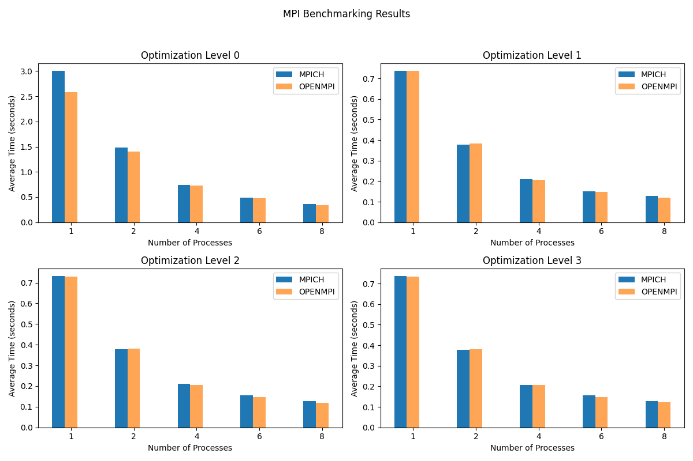
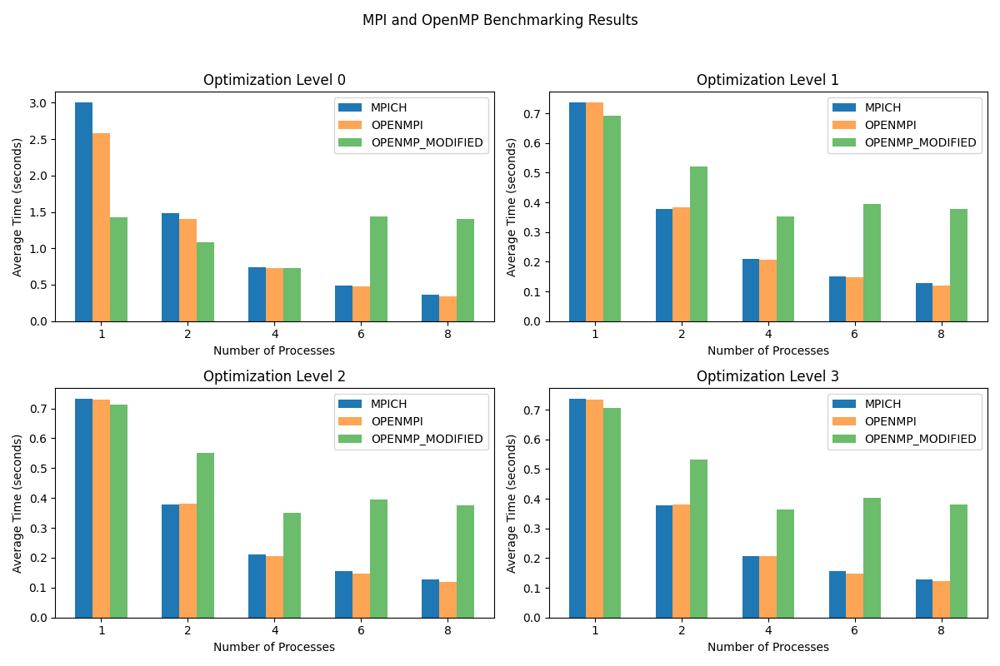
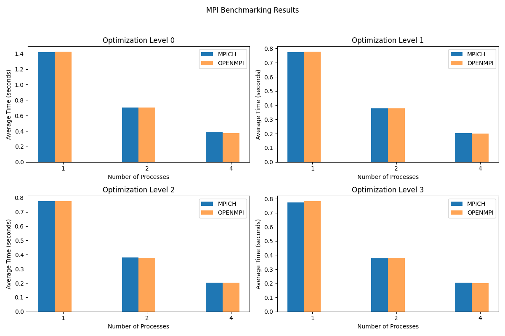
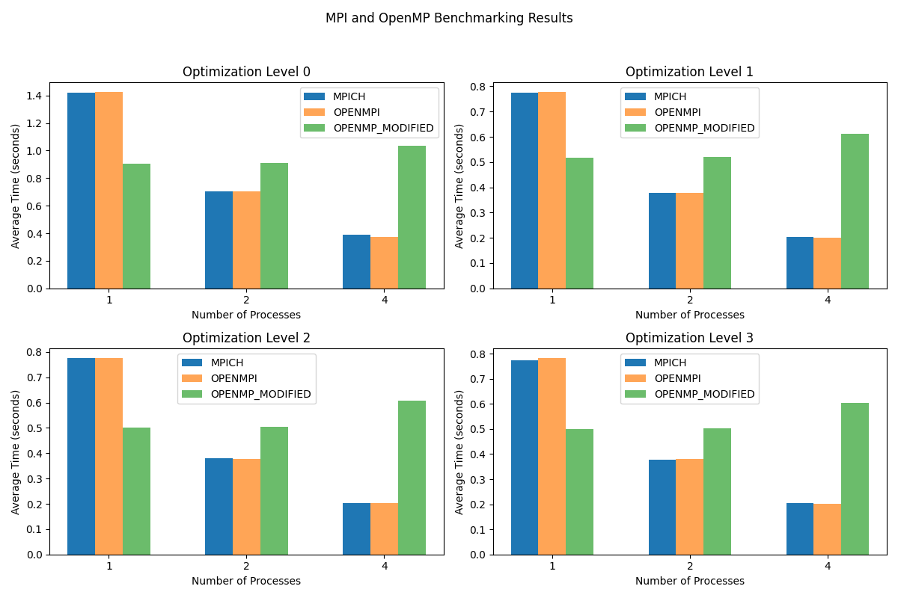
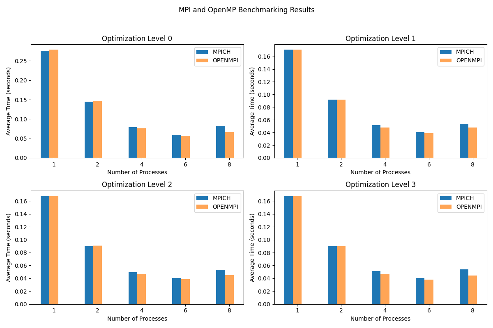
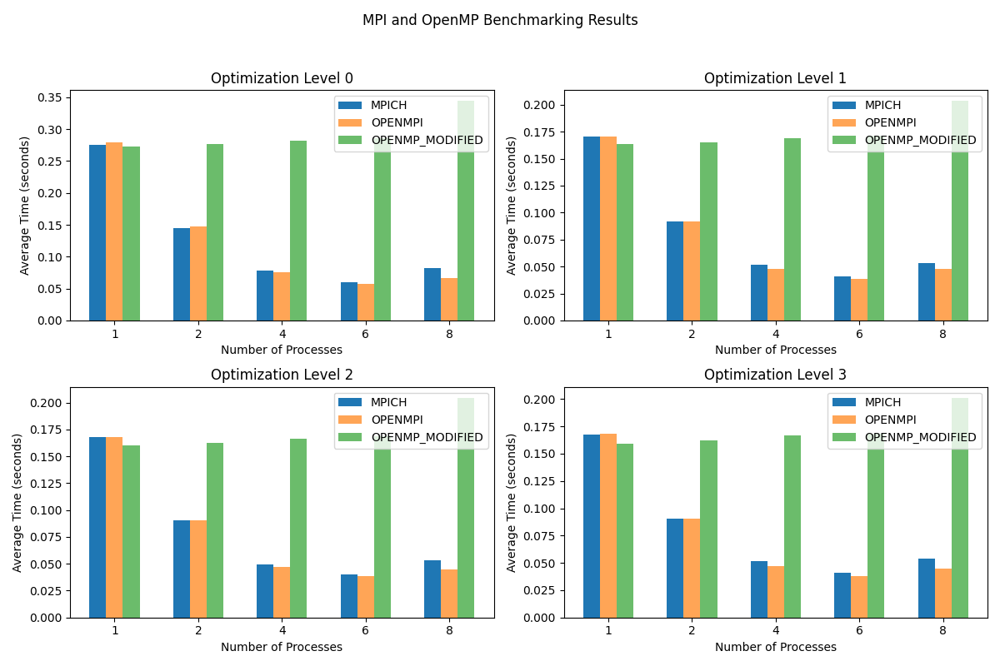

# This is a little C++ example to compare the performance of different MPI libraries.










## How to run

To run the program, run:

```bash
make MPI_IMPL=MPICH run_mpich
```
Or: 
```bash
make MPI_IMPL=OPENMPI run_openmpi
```

Or just:
```bash
make run_both
```


## Prerequisites

- C++ compiler
- OpenMPI and MPICH libraries
- mpiexec
- make
